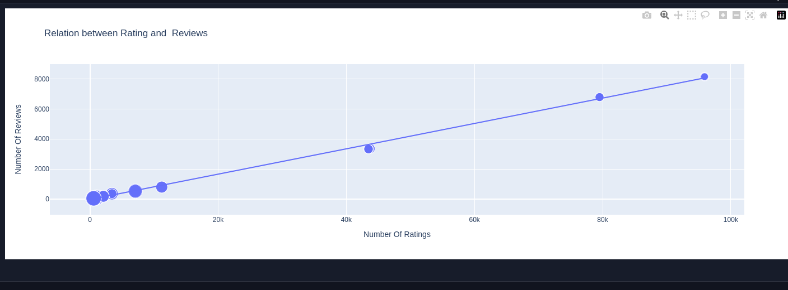

# iPhone sales analysis

I have used a few libraries like pandas, numpy, etc to analyze these sales.

## Installation

I have also added a requirement.txt file so that someone can download this project and run the file to install all the libraries.

```bash
pip install requirements.txt
```

## Main Functions

- Highest Rating Star
- Bar chart on the number of rating lists
- Bar chart on the number of review lists
- Relation between Rating and Price
- Relation between Rating and Discount Percentage
- Bar chart on the number of Ram list
- Relation between Rating and Reviews

# Demo


